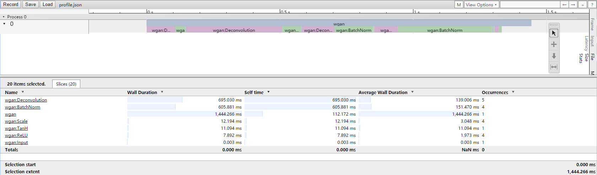

Profile your network performance
================================

It's easy to know the time your network needs to forward pass on a mini-batch. Just add a Timer and start it when you call `Forward` and stop it when `Forward` is finished. The point here is really simple, taking two time stamp at the beginning and end of the code your want to measure. Let's call this piece of code a `Scope`. Here we make network forward pass `Forward` a scope, then we can measure the performance of this scope. What if we make every layer's forward pass a scope and measure them when we call network `Forward`. Actually, we can measure the performance of every layer's `Forward`. It's pretty cool as we can see more detail performance of our network. What's why we introduce `Profiler` for Mini-Caffe.

The idea is mainly borrowed from [MXNet](https://github.com/dmlc/mxnet). I think it's awesome and introduce the idea to Mini-Caffe and make some modification. The Profiler is mainly used to measure a `Scope` as we described above. The scope represents a piece or a region of the source code. Also the scopes can be nested but not acrossed. It's convenient to introduce nested scope as we can measure something else.

The Profiler in Mini-Caffe defaultly only measures the performance at layer level if turned on. This means it only measures the `Forward` pass as we want. However, this is not so accuracy about our code as we only measure the network but not including the overhead of data processing and transformation. Usally it is OK as the overhead can be omitted. But sometimes, we run the network in GPU side or run it over and over again, the overhead at CPU side may raise, measure this part of code against the network `Forward` can be useful. The nested scope can help. Create a scope to wrap all code and we can measure network forward pass and data processing overhead.

The code below shows the basic usage of Profiler.

```cpp
caffe::Profiler *profiler = caffe::Profiler::Get();
profiler->TurnON();
profiler->ScopeStart("wgan");
// process data and copy it to network input
...
// forward network
...
// get output
...
profiler->ScopeEnd();
profiler->TurnOFF();
profiler->DumpProfile("profile.json");
```

The Profiler will dump data as json format. The data can be viewed using Chrome with URL `chrome://tracing/`. The image below shows the performance of [example/wgan](example/wgan).



As we can see, the most time consuming operation is `Deconvolution` layer and followed by `BatchNorm` layer. We can also see that the data process of network output is also consuming much time. The output of G is transformed to an image and processing very slow because of the code I write is not efficiency. If we run the network on GPU side. The overhead of slow output processing will raise much more. With the help of profile above, we will know how to optimize our code or Mini-Caffe's layer implementation.
